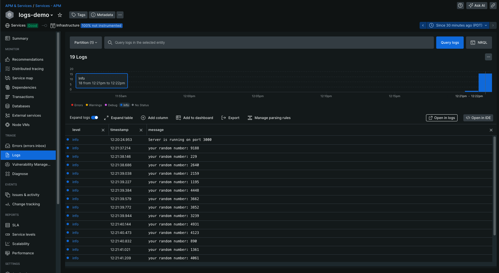

# The Student Guide to Logs

### What is a Log? 🪵 And no, we are not talking about a tree...

A **log** is formally defined as discrete, specific actions with very granular details. Doesn't make much sense, does it? Let's try to put this in other words.

Logs can be considered a fancy type of print statement that is specifically used to inform the *programmer* of the status of an application. We use logs as a way to record and report the events and behaviors of a program in a consistent, text-based format for future reference and tracking. 

Logs can come in the form of error messages, warnings, traces, informational messages, and more to quickly and easily identify the status of any process within an application. These inherently contain more information than a simple print statement and are extremely important for maintaining an application.

*Some examples of where you may have come across logs before include an HTTP status of 200 to signify that our web page is functioning as expected, or even an HTTP status of 404 to signify that an error has occurred in finding our web page.*

### Why do you want to view your logs?

Logs can be beneficial in many ways. One of the most common uses of logs is to identify **bugs** in a program. Logs have timestamps attached to each event, which can quickly inform the programmer when an issue occured. By recording and tracking these logs, we are able to identify patterns in our code where errors or warnings may be more frequent, which can reduce the amount of time programmers spend simply finding when and where issues occur.

### What does this have to do with New Relic?

New Relic is able to capture the logs for your application and integrate them into the platform. This means we can create dashboards, alerts, monitoring, and use many other New Relic features using the logs of an application. New Relic also allows you to query for logs within your application using NRQL or NerdGraph to further explore the status of your application.

To find your logs, go to [one.newrelic.com > All capabilities](https://one.newrelic.com/all-capabilities) > Logs, which is located in the left toolbar.

### Demo App for Logging

#### Introduction

We will be using the Node APM agent's example logging application, [esm-logs-in-context](https://github.com/newrelic/newrelic-node-examples/tree/main/application-logging/esm-logs-in-context), to show you how logging works in New Relic. A copy of it is included in this repo under [logs-demo](./logs-demo) for your convenience.

But first, a little context:

1. The Node agent is part of New Relic (NR)'s Application Performance Monitoring (APM), one of the first services provided by NR. The agent is called 'Node' because it instruments [Node.js](https://nodejs.org/en), the most popular JavaScript runtime environment, applications.
   1. There are many other APM agents for other popular programming languages, like Java, Python, and .NET.
2. This app requires [Docker](https://www.docker.com/products/docker-desktop/), a platform that will containerize our app, which is running a server on localhost, to be installed on your computer.
3. If you would like to test this out yourself, follow the instructions in the [README](./logs-demo/README/md).

#### Visualizing your Logs

After following the instructions the demo app's README, login to your [New Relic](https://one.newrelic.com) account. If you don't have one, you should!

After that, locate APM & Services on the right-hand side of the screen and click on `logs-demo`, our app. Below is a screenshot that shows our app name and some of the logs recently logged by our app.

As you can see, each log has a **level**, **timestamp**, and **message**. New Relic supports the following levels: errors, warnings, debug, and info.

## Resources

Here are some additional resources for further learning:

* [Node.js agent logs in context](https://docs.newrelic.com/docs/logs/logs-context/configure-logs-context-nodejs/)
* [New Relic Docs on Logging Management](https://docs.newrelic.com/docs/logs/get-started/get-started-log-management/)